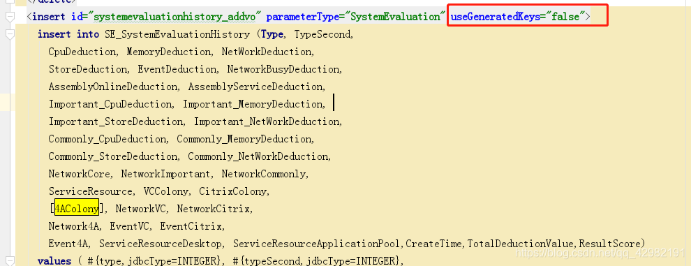

# 项目名 hmdbo
## 项目功能简介
从SqlServer数据库利用触发器从生成库的流水表将数据读取，增加名称中文查询结果和初始化状态0，
将数据存储到临时表，待系统处理。
系统将临时表的数据用定时任务读取，利用接口发送，
读取后的数据将状态更新为1，系统每天整点清除前一天状态为1的数据。
****
## 目标
将厂家系统数据库中的业务流水数据，经过整理通过系统发送到主程序。
****
## 接口文档地址：
http://localhost:8080/docs.html#/
****
## 代码生成类的位置：
com.zdh.hmdbo.generator.GenerateApplicationTests
****
## SqlServer数据库表触发器
CREATE TRIGGER test1 ON dbo.tb_fthfldtl_info FOR INSERT AS INSERT tb_fthfldtl_t_info (
colltime,
porttype,
portid,
devname,
devaddr,
density,
tempretu,
pressure,
diffpres,
flow,
sumflow,
userid,
status,
retrycnt,
PREST,
DIFFPT,
resetinfo,
warninfo,
t_stact
) SELECT
i.colltime,
i.porttype,
i.portid,
f.devname,
i.devaddr,
i.density,
i.tempretu,
i.pressure,
i.diffpres,
i.flow,
i.sumflow,
i.userid,
i.status,
i.retrycnt,
i.PREST,
i.DIFFPT,
i.resetinfo,
i.warninfo,
0
FROM
inserted i LEFT JOIN pd.fthfldev f ON i.portid=f.portid
GO
****

## 遗留问题
####这个问题在系统正式后不需要系统插入数据，暂不处理。
SqlServer数据库临时表主键设置了自增长，mybatis应该会返回自增长的id，但我并不需要。
所以在insert标签中加入 useGeneratedKeys="false"属性。

****

